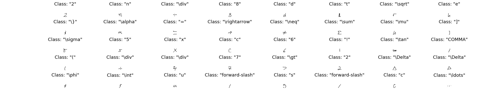
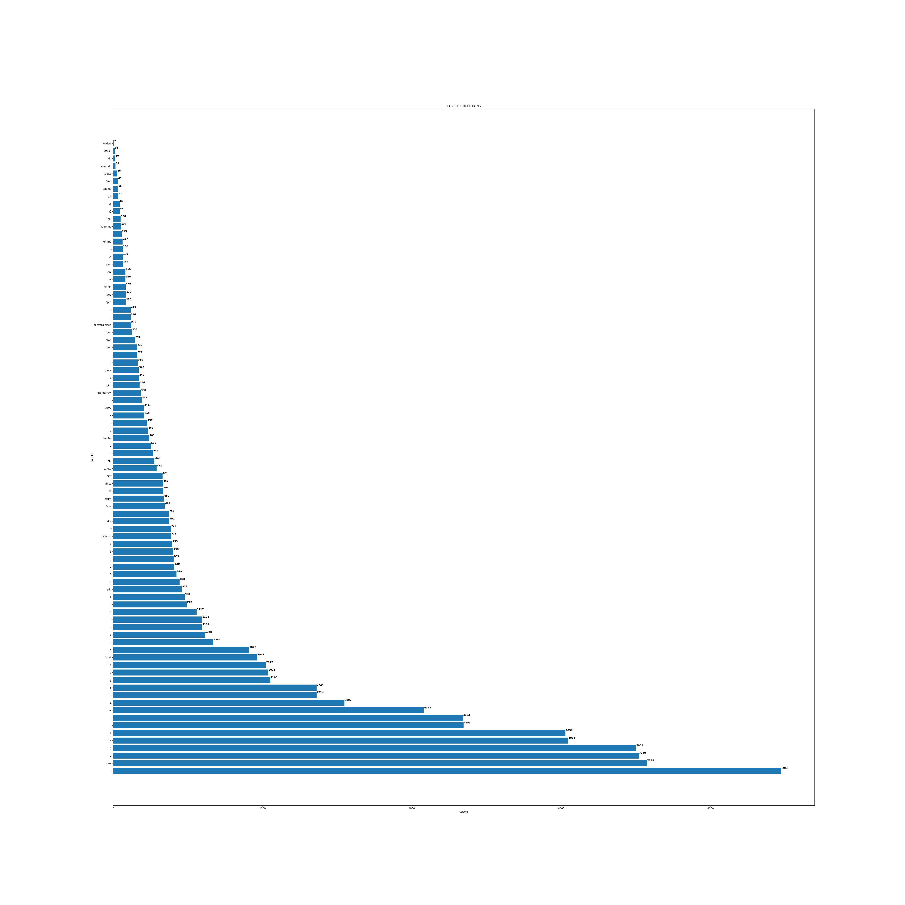

### Task - Download CROHME-19 Dataset & Perform Data Analysis - Done as experimentation work at GahanAI

*What is CROHME-19?*

It is the dataset for the "Competition on Recognition of Handwritten Mathematical Expressions and Typeset Formula Detection". We focus on the dataset used for Task 2 - Offline Handwritten Formula Recognition. [Click Here](https://www.cs.rit.edu/~crohme2019/task.html) to know more about Task 2.

**Instructions to Download CROHME-19**

[Click Here](https://www.cs.rit.edu/~crohme2019/downloads/Task1_and_Task2.zip) to download the train dataset needed for Task2

[Click Here](https://www.cs.rit.edu/~crohme2019/downloads/zipped_CROHME2019_testData.zip) to download the test dataset needed for Task 2

**Do the following steps, once the datasets have been downloaded**
1. Unzip the train data files in *Task1_and_Task2 > Task1_onlineRec > subTask_symbols > Train, Test, Validation*
2. Open Terminal, change working directory to *Task1_and_Task2 > Task2_offlineRec*
3. Run imgGenerator. Generated files stored in: *Task1_and_Task2 > Task2_offlineRec > subTask_symbols > Train, Test, Validation*

#### Findings - after running imgGenerator
- Test Folder is empty
- Validation has one folder: data_png_testSymbols
- Train has 4 folders: 2011, 2013 and 2014, 2014 junk data and train data label (XXX_GT.txt)
- Run script (data_preprocessing.py) to separate PNGs into separate label folders

#### Findings - after running data_preprocessing.py
- The number of PNGs in 2014 Junk folder and number of labels in 2014 Junk GT label file **DO NOT match**.
- Total Data points available:

|**Data Folder Names** (renamed by me)| **Number of entries in data folder** | **Number of enrties in labels txt files** |
|-------------------------------------|--------------------------------------|-------------------------------------------|
| data_png_symbols (2014 data) | 85802 | 85802 |
| **data_png_junk (from 2014)** | **141821** | **74284** |
| data_png_2013 | 12504 | 12504 |
| data_png_2012 | 7850 | 7850 |

### Task 1B - Data Visualization

- To get an overview of the CROHME-19 dataset, we wrote a script to generate an image containing a random sample from 40 different classes in the dataset.

- I also generate an image containing the distriution of number of samples in each class in the dataset. From the picture below, we can see that the dataset is imbalanced and hence there is a need to perform data augmentation.

### Task 1 Scripts

There are 3 scripts developed to perform Tasks 1A and 1B:

- **config.json** - Things in this file needs to be changed according to how and where the dataset folders are organized in your system.
- **data_preprocessing.py** - To segregate each PNG image (generated using imgGenerator.exe) into it's own separate class folder.
- **data_viz.py** - To generate the an image containing random samples of data and generate label distribution graphs.
